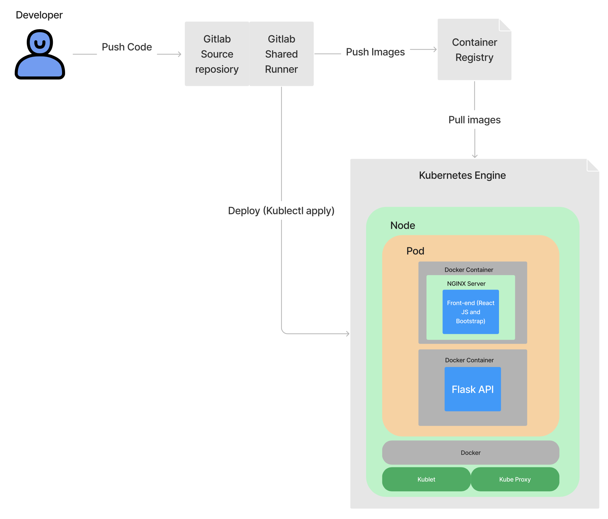

# CIS3760 - Group 203

# **You can access our production server at https://35.237.83.181**

## Overview

Our scheduler app allows the user to create a class schedule using data sourced from UofG's WebAdvisor. It is a work-in-progress.

## Tech

**Frontend**
- React
- Bootstrap
- Axios
- Hosted behind NGINX

**Backend**
- Flask (used as REST API)
- Hosted behind Gunicorn

## Running locally

In order to run the stack locally, you must have Docker and docker-compose installed and configured.

If you are on a modern flavor of Linux, you can run the `install.sh` script in the project base. This will install and configure Docker + docker-compose.

**To bring up the project, run:**
```
docker-compose up
```

This will build the `app` and `api` containers, and run them in the foreground (you can append the `-d` flag to run in daemon mode)

You can access the frontend at https://localhost. The Flask API can be reached at https://localhost/api. 

**To bring down the project, run:**
```
docker-compose up
```

If the stack is running in the foreground, Ctrl+C will work as well.

**To rebuild the project, run:**

```
docker-compose build
```

## Production Environment



Our app is externally hosted using Google Cloud Platform's Kubernetes Engine. We also utilize GitLab Runners to build and package our images, and move them to Container Registry for storage. From there, the deployment is triggered by a GitLab pipeline task and the Kube master node automatically revises the cluster.

You can access our production server at https://35.237.83.181

# Sprint 1 - Sprint 3 (Legacy)

## Overview

`htmlparser` parses an `.html` file and creates two `.json` files for usage by `coursesearch`

`htmlparser` assumes that the html input into the program contains specific string prefixes found in the `id` tag of the html element or in the case of meeting times, the `class` tag. The prefixes used in the program have been listed below:

| Data Type          |    id/class prefix     |
| :----------------- | :--------------------: |
| term               | WSS\*COURSE_SECTIONS\* |
| status             |      LIST\*VAR1\*      |
| location           |    SEC\*LOCATION\*     |
| meeting            |          meet          |
| professor          |  SEC\*FACULTY_INFO\*   |
| available capacity |      LIST\*VAR5\*      |
| credits            |    SEC\*MIN_CRED\*     |
| section title      |    SEC_SHORT_TITLE     |
| level              |   SEC\*ACAD_LEVEL\*    |

`coursesearch` searches a `.json` or an `.html` file for a course. `coursesearch` allows one to search by course code or course name

`json-to-csv` parses a `.json` file and creates 2 `csv` files for usage by `scheduler`. The two csv files created are named meetings.csv and section.csv.

`scheduler.xlsm` searches through these `.csv` files for the courses and allows to add upto 5 courses to the schedule. It also draws a time table for selected courses, suggests additional courses, and creates a `.pdf` of the schedule.

For each section, we store every seperate meeting as a unique ID. These ID's then link to the meetings.csv file where all the required information for the meetings is stored.

## Usage

### Scheduler

One can select courses as part of their schedule by placing course codes with the section number in the fields labeled **Courses**. Example: `CIS2520*0201`

`Generate Timetable` will generate a timetable based on the selected courses. Blue indicates the meeting has no conflicts. Red indicates there is a conflict. Purple in the exam timetable indicated that two exams have the same time but are 7 days apart.

`Suggest Courses` will suggest up to 5 courses that do not create a new conflict. One can select restrictions by selecting checkboxes, for example, they can request that no course suggested has a meeting in the morning. Some checkboxes are mutually exclusive. For example, one cannot avoid both morning and evening courses. `Suggest Courses` will suggest a course for every empty space in the in the fields labeled **Courses**. Place a `~` to indicate you do not want a course suggested for that space

`Export As PDF` will generate a `.pdf` of the currently drawn schedule in the `timetable` folder. Currently, the path is configured for a Windows operating system. To have a correct file path on Linux or MacOS, one will have to modify the path. The `.pdf` must not be open when generating a new `.pdf`

Open the Developer tab on Excel (This may not be enabled by default), click `Visual Basic`, access Module4 and find the following line of code: `path = Replace(ThisWorkbook.path, "\csv", "\timetable\schedule.pdf", 1, 1)` Replacing the `\` with `/` will enable the path for Linux or MacOS. One can also change the name of the `.pdf` or the folder it is generated by modifying `"\timetable\schedule.pdf"`. Do so at your own risk.

`Clear Schedule` will clear the schedule generated by `Generate Timetable`

`Clear Selection` will clear all the courses in the fields labeled **Courses**

#### Initial Set up

After running json-to-csv, import the 2 csv files into the scheduler.xlsm file by using `=` as the delimiter.

**NOTE:** if a course does not exist, a pop up will be displayed saying that the course does not exist.

### htmlparser

`htmlparser <html_file>`

`<html_file>` is the name of the `.html` file to be parsed.

`htmlparser` will create two `.json` files in a directory called `data`: `results.json` and `course_mapping.json`.

**NOTE:** any additional formatting applied to the HTML file to be parsed has the potential to cause unexpected behaviour and break the parser. Ensure the HTML file is as it was downloaded from the web without unnessecarry newline characters.

##### Notes

`results.json` may be renamed and used by `coursesearch` by using the `--in` tag.

**DO NOT** rename or move `course_mapping.json`. See the notes section for the coursesearch for more details

### coursesearch

`coursesearch <course_code|course_name> [--in input_file.json|--html input_file.html]`
`coursesearch [-h|--help]`

`<course_code|course_name>` is the course code or the name of the course.
`input_file.json` is the name of the `.json` file to be used.
`input_file.html` is the name of the `.html` file to be used.

Using the `-h` or `--help` tag will display a help message.

After the initial search, one may make additional searches or exit the program.

### json-to-csv

`./json-to-csv [input_json] [output_dir]`

`<input_json>` is the name of the `json` file to be parsed.

**NOTE:** any additional formatting applied to the json file to be parsed has the potential to cause unexpected behaviour and break the parser.

##### Notes

By default, `coursesearch` will use `/data/results.json` and `/data/course_mapping.json`. Using the `--in` tag will allow you to specify a file instead of `/data/results.json`

`coursesearch` **requires** there to be `/data/course_mapping.json`. **DO NOT RENAME OR MOVE THIS FILE.** Using `htmlparser` or a correct usage of the `--html` tag will recreate this file.

Usage of `--html` tag **requires** the `htmlparser` file to be in the same directory as `coursesearch`.

Usage of the `--html` is equivalent of running `htmlparser` prior to `coursesearch`. As a result, the initial search will take longer than normal.

### Testing

You can run the full test suite (covering coursesearch and htmlparser) by running the following command:
`python3 -m unittest discover -s tests`

## JSON Formating

### JSON format for a course section

{
"meeting": [],
"term": "Fall 2022",
"status": "Closed",
"department": "CIS",
"courseCode": "3760",
"section": "0101 ",
"num": "7263",
"courseName": "Software Engineering",
"location": "Guelph",
"faculty": "G. Klotz",
"available": "0",
"capacity": "32",
"credits": "0.75",
"academicLevel": "Undergraduate"
}

meeting: An array of meeting JSONs as a string. See below
term: The term the course is offered in, e.g. "Fall 2022"
status: Whether the course is open or closed. e.g. "Closed"
department: The department the course belongs to e.g. "CIS"
courseCode: The course code e.g. "3760"
section: The section number e.g. "0102"
num: A number of unknown importance. Included just in case, e.g. "7264"
courseName: Name of the course e.g. "Software Engineering"
location: The campus the course is on, e.g. "Guelph"
faculty: The instructor for the course e.g. "G. Klotz"
registeredStudents: Number of students registered for a course. e.g. "0"
capacity: How many students can register for a course e.g. "32"
credits: How many credits the course is worth e.g. "0.75"
academicLevel: Course level e.g. "Undergraduate"

### JSON format for meeting times

{
"meeting_type": "LEC",
"meeting_day": "Tues,Thur",
"start_time": "08:30AM",
"end_time": "09:50AM",
"building": "RICH",
"room": "Room 2529"
}

meeting_type: Whether the meeting is a lecture, lab, seminar or exam e.g. "LEC"
meeting_day: Day(s) of the week the meeting is held e.g. "Tues,Thur"
startTime: Starting time for the meeting e.g "08:30AM"
endTime: Ending time for the meeting e.g "09:50AM"
building: Building in which the meeting is held e.g. "RICH"
room: Room where the meeting is held e.g. "Room 2529"

### Example of JSON

{
"meeting": [
{
"meeting_type": "LEC",
"meeting_day": "Tues,Thur",
"start_time": "08:30AM",
"end_time": "09:50AM",
"building": "RICH",
"room": "Room 2529"
},
{
"meeting_type": "LAB",
"meeting_day": "Mon",
"start_time": "11:30AM",
"end_time": "01:20PM",
"building": "THRN",
"room": "Room 2420"
}
],
"term": "Fall 2022",
"status": "Closed",
"department": "CIS",
"courseCode": "3760",
"section": "0101 ",
"num": "7263",
"courseName": "Software Engineering",
"location": "Guelph",
"faculty": "G. Klotz",
"available": "0",
"capacity": "32",
"credits": "0.75",
"academicLevel": "Undergraduate"
}

### Example JSON for course_mapping.json file

{
"INTRO FINANCIAL ACCOUNTING": "ACCT1220",
"MANAGEMENT ACCOUNTING": "ACCT2230",
"AUDITING I": "ACCT3280",
"INTERMED FINANCIAL ACCOUNT I": "ACCT3330",
"INTERMED FINANCIAL ACCOUNT II": "ACCT3340",
"TAXATION": "ACCT3350",
"ADVANCED FINANCIAL ACCOUNTING": "ACCT4220",
}
